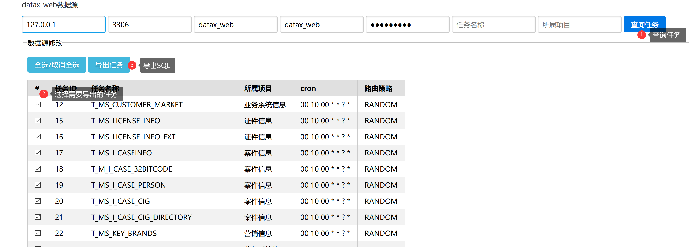
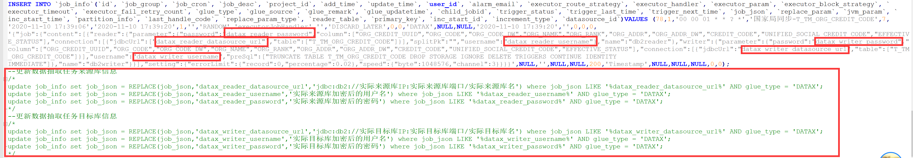

### 一、打包
```
mvn clean package
```

### 二、启动项目
```
java -jar datax-web-export-0.0.1-SNAPSHOT.jar
```
访问页面
http://127.0.0.1:8080/export/index.html



### 三、导出结果
导出的SQL会将datax任务的reader以及writer(仅支持关系型数据库)的数据库连接信息替换为特殊字符串，方便不同环境的迁移


